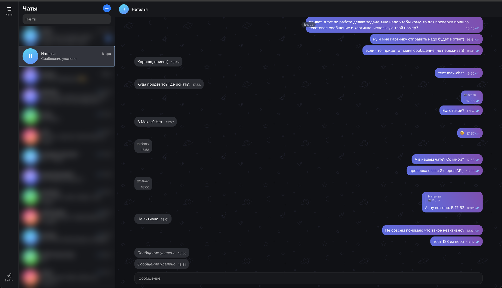

# MAX · GREEN-API чат

[](https://github.com/<owner>/green-api-chat/actions/workflows/ci.yml)

Тестовое задание GREEN-API: веб-интерфейс для отправки и приёма текстовых сообщений в MAX.
Демо: https://max-chat.vitovtsev.site



## Что умеет

- вход по `idInstance` и `apiTokenInstance`
- новый чат по номеру телефона (проверка через `checkAccount`)
- отправка текста (`sendMessage`) и приём через HTTP API (`receiveNotification` / `deleteNotification`)
- история чата (`getChatHistory`), статусы доставки и прочтения
- работа в нескольких вкладках: очередь уведомлений читает только одна

## Как запустить

Нужен Node.js 22 или новее.

```bash
npm i
npm run dev        # http://localhost:5173
npm test           # тесты
npm run verify     # типы, линтер, тесты, сборка
```

## Где взять данные

console.green-api.com → создать инстанс MAX → авторизовать по QR → скопировать `apiUrl`, `idInstance`, `apiTokenInstance`.

В настройках инстанса:
- webhook URL: пустой
- уведомления о входящих сообщениях включены (`incomingWebhook`)
- уведомления о статусах исходящих сообщений включены (`outgoingWebhook`): нужны для галочек «доставлено» и «прочитано»
- уведомления о сообщениях, отправленных с телефона, включены (`outgoingMessageWebhook`); необязательно, пригодится, если отвечаете с телефона

## Как устроено

```
ui → store → core → api
```

Направление зависимостей одностороннее и закреплено правилом ESLint (`no-restricted-imports` в `eslint.config.js`): `api` не знает про `core`, `store` и `ui`; `core` не знает про React и store; `store` не знает про UI. Слой можно тестировать и переиспользовать отдельно от остальных.

- `api`: тонкий fetch-клиент (`getStateInstance`, `sendMessage`, `getChatHistory`, `checkAccount`, `receiveNotification`, `deleteNotification`). Маскирует токен в тексте ошибок и сетевых сообщений (`mask.ts`), различает виды ошибок (`unauthorized`, `notAuthorized`, `rateLimit`, `quota`, `network`, `validation`, `unknown`).
- `core`: чистые функции и цикл опроса без побочных эффектов на React или store: разбор уведомлений (`notifications.ts`), нормализация номера (`phone.ts`), слияние истории и статусов сообщений (`messages.ts`, `history.ts`), сам поллер (`poller.ts`) и лидер вкладки (`leader.ts`).
- `store`: Zustand-хранилище и действия (`login`, `createChat`, `sendMessage`, `retryMessage` и другие), которые дергают api и core и пишут в state.
- `ui`: компоненты на `@maxhub/max-ui` и CSS Modules, читают store через селекторы.

### Цикл опроса

Каждая итерация вызывает `receiveNotification` с таймаутом 20 секунд. Если уведомление пришло, оно разбирается и передаётся в store. После этого в любом случае вызывается `deleteNotification`, даже если разбор упал или чат не найден в списке: иначе очередь на сервере встанет. Пустой ответ чаще раза в секунду не запрашивается: между пустыми опросами выдерживается минимум 1 секунда, чтобы не долбить сервер при мгновенных ответах. На сетевых ошибках и `rateLimit` включается пауза с экспоненциальным ростом и джиттером (полный джиттер, кап 30 секунд); после успешного цикла счётчик попыток сбрасывается. На `unauthorized` (401) поллер останавливается, и приложение разлогинивает пользователя.

### Лидер вкладки

Опрос ведёт только вкладка, которая держит Web Lock `greenapi-poll-<idInstance>`. Остальные вкладки переходят в режим `follower` и показывают баннер о том, что приём сообщений идёт в другой вкладке; их состояние подтягивается через персист. Отправлять сообщения можно из любой вкладки независимо от того, кто сейчас лидер.

### Статусы и буферизация

У исходящего сообщения статус растёт только вперёд: `pending → sent → delivered → read`, а `failed` терминален. Статус меньшего ранга, пришедший позже, игнорируется. Иногда статус приходит раньше, чем сервер вернёт `idMessage` в ответ на `sendMessage`: эхо-уведомление и статус приходят отдельными событиями. Такие ранние статусы складываются в буфер по `idMessage` и применяются, как только локальное сообщение получает настоящий id.

### Ручной повтор

У `sendMessage` нет ключа идемпотентности, поэтому автоматических ретраев нет: повторная отправка после сбоя происходит только по кнопке «Повторить», чтобы не создать дубликат у получателя.

### Защита от устаревших ответов

У каждой сессии опроса есть номер поколения. Асинхронные операции (создание чата, перезагрузка истории, отправка сообщения) запоминают номер поколения перед запросом к API. Если за время ожидания ответа пользователь вышел или перезашёл и поколение сменилось, результат не применяется.

### Данные и инстанс

Список чатов и сообщений в persist-хранилище проверяется на владельца по `idInstance`. Если сохранённые данные принадлежат другому инстансу (например, сменился аккаунт на этом же компьютере), они сбрасываются перед стартом новой сессии. Номер телефона и `chatId` в MAX не совпадают: новый чат создаётся через `checkAccount`, который по номеру возвращает числовой `chatId`, и дальше все операции (отправка, история, сопоставление входящих) идут по этому `chatId`.

## Ограничения

- токен хранится в браузере (`sessionStorage`, или `localStorage` при «Запомнить меня») и уходит в путь URL: так устроен API. В продакшене запросы шли бы через свой бэкенд
- номера только России (+7) и Беларуси (+375): так работает `checkAccount` в MAX
- история: последние 100 сообщений
- показываются только чаты, созданные в этом интерфейсе
